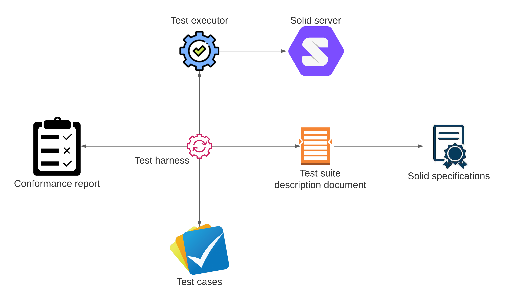
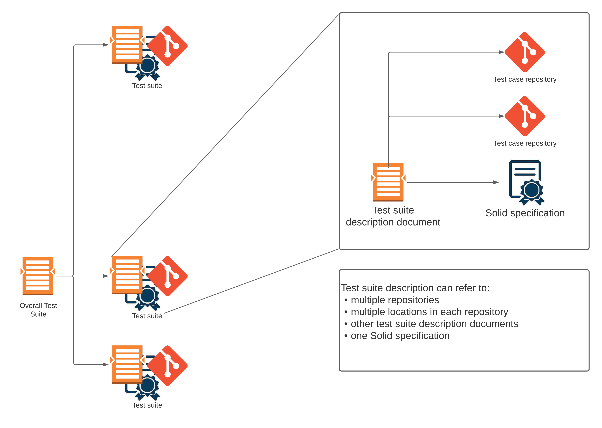
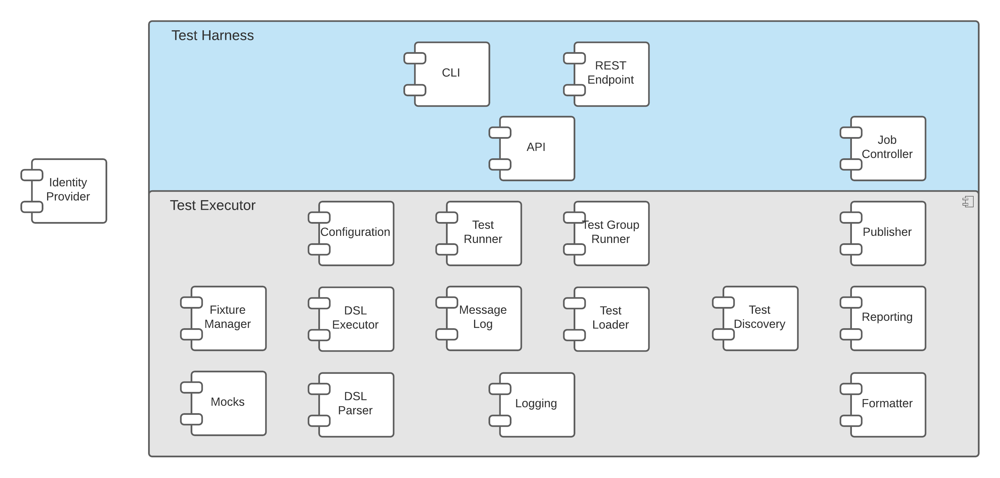

# conformance-test-harness
The Conformance Test Harness (CTH) is used to run Solid conformance tests against Solid servers, and generate reports of the test results.

<!-- MarkdownTOC -->

- [Repository Structure](#repository-structure)
- [Architecture:](#architecture)
	- [Test Harness](#test-harness)
	- [Test Executor](#test-executor)
	- [Test Suite Description Document](#test-suite-description-document)
	- [Test Cases](#test-cases)
	- [Conformance Report](#conformance-report)
- [Component Architecture](#component-architecture)
- [Writing Tests](#writing-tests)
- [Processes:](#processes)
    - [1. Checkout](#1-checkout)
    - [2. Setting up the Environment](#2-setting-up-the-environment)
    - [3. Build and Test](#3-build-and-test)
    - [4. Package](#4-package)
    - [5. Docker Image](#5-docker-image)
    - [6. Release](#6-release)

<!-- /MarkdownTOC -->


## Repository Structure
* architecture - Architectural diagrams.
* config - Configuration files used to run the example test cases.
* example - Proof of Concept (PoC) test cases demonstrating use of the CTH.
* src/main - The source of the CTH.
* src/test - Unit tests for the CTH itself.

## Architecture


### Test Harness
The Test Harness controls the overall execution of a test suite. It is responsible for loading the test suite, locating
the tests, creating and controlling test executors, and generating test suite conformance reports.

The Test Harness provides different interfaces to the test suite such as a REST API and a command line interface, and
is platform agnostic. 

### Test Executor
The Test Executor is responsible for executing tests against a Solid server. The harness can create multiple Test
Executors where each is responsible for executing a set of tests. Test Executors do not need to run on the same host as
the Test Harness. 

### Test Suite Description Document
This is a Resource Description Framework (RDF) document containing metadata about the test suite. 



The metadata includes:
  * Prerequisites (e.g., dependencies).
  * Requirements level from the specification (e.g., MUST, SHOULD, MAY, etc.).
  * References to the appropriate section in the Solid specification.
  * References to the actual test cases.

The Test Harness uses the linkage between the test suite document, the RDF in the Solid specifications, and the
available Test Cases to determine how much of the specifications are covered by the Test Suite. This is available
as a yest coverage report.

**Note**: The Test Suite may not include all tests required to cover the Solid specifications.

### Test Cases
The Test Cases are contained in a repository, grouped into logical sets of tests. 

### Conformance Report
Conformance Reports are generated using EARL, thereby making them available for consumption by many different tools.
Output is available in HTML+RDFa format.


## Component Architecture

The following is an illustration of the component architecture for the Test Harness and Executor.

**Note**: This architecture is liable to change as the project progresses.




## Writing Tests

Refer to the notes in the [specification-test repository](https://github.com/solid/specification-tests).

## Processes
The following steps describe the release process.
### 1. Checkout
```shell
git clone git@github.com:solid/conformance-test-harness.git
```

### 2. Setting up the Environment
There are 4 important settings:
1. `target` - The IRI of the target server, used to select the server configuration from the configuration file.
1. `subjects` - The location of the file describing test subjects.
1. `sources` - The locations of annotated Solid specification documents that list the test cases to be run.
1. `mappings` - Maps test cases IRIs to a local file system (there can be multiple mappings). Mappings should be
  ordered so the most specific is first. This allows individual files to be mapped separately from their containing
  directories.

To set these properties, you can provide `config/application.yaml` in the working directory
containing:
```yaml
target: TARGET_SERVER_IRI
subjects: PATH_TO_SUBJECTS_DOC
sources:
  - PATH_TO_SPECIFATION_DOC
  - PATH_TO_SPECIFATION_DOC
mappings:
  - prefix: https://github.com/solid/conformance-test-harness/example
    path: example
```
This method works well when running your tests in an Integrated Development Environemnt (IDE) as it doesn't require
anything adding to the command line. If there is only one test subject defined in the `test-subjects.ttl` file, then the
target property can be omitted as this will be selected by default.

Alternatively, you can set these as command line options as described later. 

### 3. Build and Test
To run the unit tests on the Test Harness itself:
```shell
./mvnw test
```
The test coverage report is available here:`target/site/jacoco/index.html`

To run the test suite against whichever server is configured in your `.env` file:
```shell
./mvnw test -Psolid
```

Using an IDE, you can also run a specific scenario by editing the TestScenarioRunner and then running it as you would any
unit test:
```java
String featurePath = "classpath:writing-resource/containment.feature";
Results results = testRunner.runTest(featurePath);
```

You can also go to the TestSuiteRunnner class and run the whole test suite in the same way.

**Note:** You must configure the IDE to include the following command line option to make Quarkus use the production
profile when running tests:
```
-Dquarkus.test.profile=prod
```

When you run the tests form JUnit (as above), some additional reports are created by Karate which can be useful for
developers:

|Report|Location|
|------|--------|
|Summary report|`target/karate-reports/karate-summary.html`|
|Timeline|`target/karate-reports/karate-timeline.html`|

### 4. Package
The Test Harness can be packaged into a single jar:
```shell
./mvnw package
```
To quickly build this package without running the unit tests:
```shell
./mvnw -DskipTests package
```
This creates `target/solid-conformance-test-harness-runner.jar` which can be deployed to its own directory and run as:
```shell
java -jar solid-conformance-test-harness-runner.jar
```

### 5. Docker Image
To build a local copy of the Docker image:
```
docker build -f src/main/docker/Dockerfile -t testharness .
```

The CD workflow in GitHub also builds a Docker image and deploys it to DockerHub:
https://hub.docker.com/r/solidconformancetestbeta/conformance-test-harness

### 6. Release
1. Check config files, scripts and examples here and in the specification-tests repo for any changes.
2. Update CHANGELOG.md to highlight new features.
3. Commit changes and merge as part of a PR.
4. Prepare the release:
    ```shell
    ./mvnw release:prepare
    ```
    The first time you run this command, it will ask various questions to help setup `release.properties` which will be
    used for future releases. This process automatically modifies `pom.xml` to prepare a release version, commits the
    change, and tags the repository, then sets up the project ready for the ongoing development of the next version.

    You can test this process, and undo the results with:
    ```shell
    ./mvnw release:prepare -DdryRun=true
    ./mvnw release:clean
    ```
5. Perform the release (whilst avoiding deploying to a maven repository or re-running the tests):
    ```shell
    ./mvnw release:perform -Darguments="-Dmaven.deploy.skip=true -DskipTests"
    ```
6. Create the release in GitHub - [Create a new release](https://github.com/solid/conformance-test-harness/releases/new):
   * Choose the tag that was just created.
   * Add a title, e.g. `Release 1.0.0`.
   * Add some content describing notable changes.
   * Publish the release.
7. Inform any teams using their own scripts of changes such as configuration or spec/manifest sources.